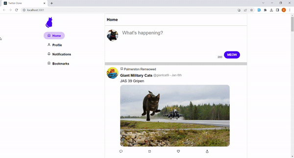

# Twitter-Clone

## Technologies used

- React
- JS
- CSS
- HTML

## Functionality

- The user can post a tweet. It will render in real time, and this tweet can be liked and shared.
- The user can follow/unfollow other users
